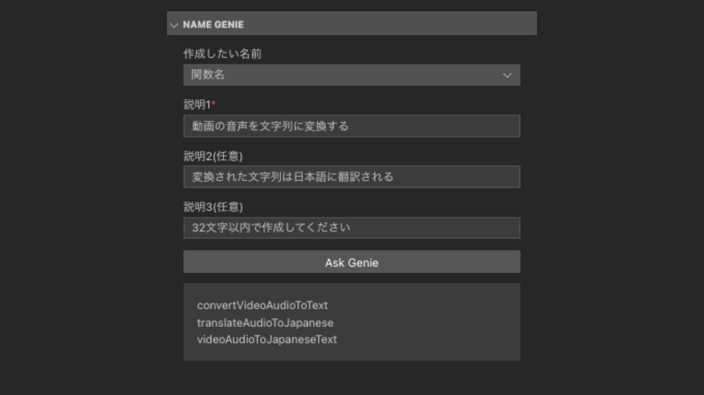

  <picture>
    <source media="(prefers-color-scheme: dark)" srcset="static/name-genie.png">
    
  </picture>

# Name Genie

**The VSCode extension addresses the common challenge that developers face when it comes to naming. It provides a solution for naming conventions.**

## Features

The extension provides the following features:

- Name Genie automatically generates names for variables, functions, and class names that you want to create.
- You can provide up to three descriptions, and the feature will generate a name based on the given descriptions.

## Links

- [Visual Studio Marketplace](https://marketplace.visualstudio.com/items?itemName=takagimeow.name-genie)
- [GitHub Repository](https://github.com/takagimeow/name-genie)

## Requirements

In order to use this extension, you will need an API key from OpenAI.

1. Go to [OpenAI's account page](https://platform.openai.com/account/api-keys). If you don't have an account, you will need to create one or sign up.
2. Click on the `Create new secret key` button.
3. Copy the key and paste it into the `API Key for ChatGPT` field in the extension settings.

## Extension Settings

Include if your extension adds any VS Code settings through the `contributes.configuration` extension point.

For example:

This extension contributes the following settings:

- `name-genie.apiKey`: The key is used to authenticate with the OpenAI API.

| Key                 | Description                                          | Value       |
| ------------------- | ---------------------------------------------------- | ----------- |
| `name-genie.apiKey` | The key is used to authenticate with the OpenAI API. | `xx-xx-xxx` |

For this extension to work, the above setting must be set.

Optional settings:

| Key                      | Description                             | Value                                          |
| ------------------------ | --------------------------------------- | ---------------------------------------------- |
| `name-genie.model`       | The model used to generate texts.       | `gpt-4`, `gpt-3.5-turbo-0301`, `gpt-3.5-turbo` |
| `name-genie.temperature` | The temperature used to generate texts. | `0.1` ~ `1.0`                                  |

## Disclaimer

This extension is not an official extension of OpenAI.
The author of this extension is not affiliated with OpenAI in any way.

## Privacy Policy

The texts are generated via the online service of [ChatGPT](http://chat.openai.com/).
Please take a look at the [privacy policy](https://openai.com/policies/privacy-policy) of OpenAI.
Do not use this extension if you do not agree with the privacy policy.

## Release Notes

Users appreciate release notes as you update your extension.

### 1.0.0

Initial release of name-genie

[MIT LICENSE](LICENSE)
